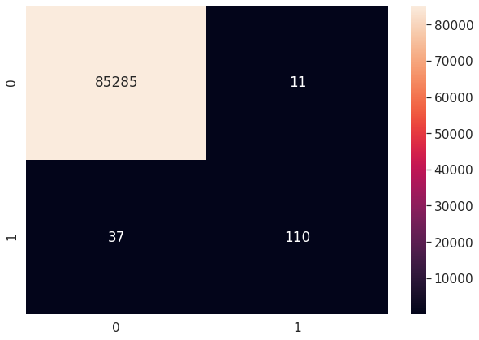
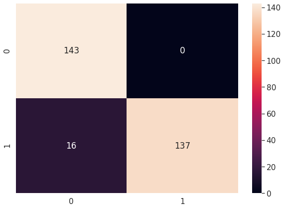
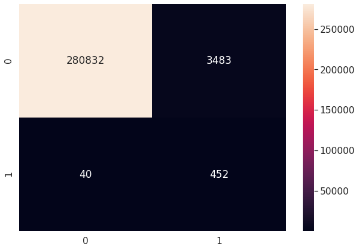
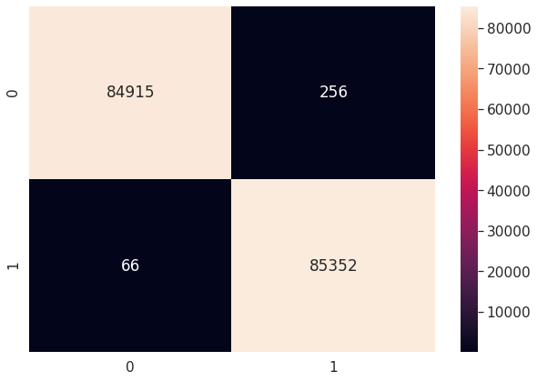

# Credit Card Fraud Detection
This repo consists of the Credit Card Fraud Detection Case Study from Super Data Science's course, Machine Learning Practical: 6 Real-World Applications.

## Problem Statement
In this case study, we assume that we have our own Book Store, and we have sold thousands of books, in the Last Year, and we are going to use our Transaction History to build a Fraud Detection System. One of the Biggest Issues with this problem is that the vast majority of Users will not be Fraudulent, thereby making it harder for us to detect the Underlying Patterns in the Information Available. In simple words, the dataset would be a **Highly Unbalanced** Dataset.

## Model Used
In this case study, we have used 2 different Classification Models,*Decision Tree Classifier* and *Random Forest Classifier*, & compared them later on the basis of Different Metrics. Also, we have used *Convolutional Neural Networks (Deep Learning)* to make the same model, and to compensate for the Highly Unbalanced Dataset, we have also used **Sampling Techniques**, such as *Under-Sampling* and *Over-Sampling*.

## Libraries Used
- Pandas
- Numpy
- Matplotlib
- Seaborn
- Scikit Learn
- Keras

## Confusion Matrix (Decision Tree Classifier)
*The following plot (Seaborn Heatmap) shows the Confusion Matrix for the Test Set Results & the Predicted Results, using the Decision Tree Classifier Model*
 
 

## Confusion Matrix (Random Forest Classifier)
*The following plot (Seaborn Heatmap) shows the Confusion Matrix for the Test Set Results & the Predicted Results, using the Random Forest Classifier Model*
 
 

## Confusion Matrix (Convolution Neural Network | No Sampling Technique)
*The following plot (Seaborn Heatmap) shows the Confusion Matrix for the Test Set Results & the Predicted Results, using a Convolutional Neural Network (CNN), without any Sampling Technique*
 
 

## Confusion Matrix (Convolution Neural Network | Undersampling)
*The following plot (Seaborn Heatmap) shows the Confusion Matrix for the Test Set Results & the Predicted Results, using a Convolutional Neural Network (CNN), with the use of Undersampling **(Undersampling Techniques remove examples from the training dataset that belong to the majority class in order to better balance the class Distribution)**. The first image shows the Confusion Matrix of the results of the Reduced Dataset, while the second image shows the Confusion Matrix of the results of the Entire Dataset.*
 
 

## Confusion Matrix (Convolution Neural Network | Oversampling)
*The following plot (Seaborn Heatmap) shows the Confusion Matrix for the Test Set Results & the Predicted Results, using a Convolutional Neural Network (CNN), with the use of SMOTE (Synthetic Minority Oversampling TEchnique) **(SMOTE works by selecting examples that are close in the feature space, drawing a line between the examples in the feature space and drawing a new sample at a point along that line)**. The first image shows the Confusion Matrix of the results of the Test Dataset, while the second image shows the Confusion Matrix of the results of the Entire Dataset.*
 
 

